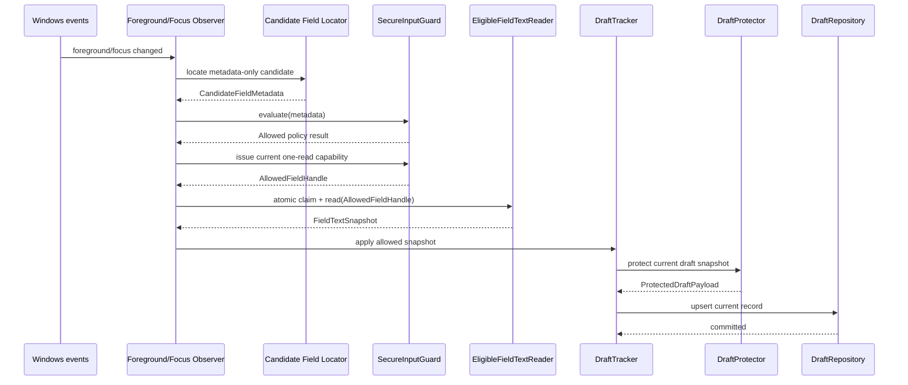
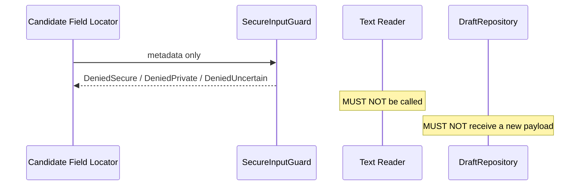
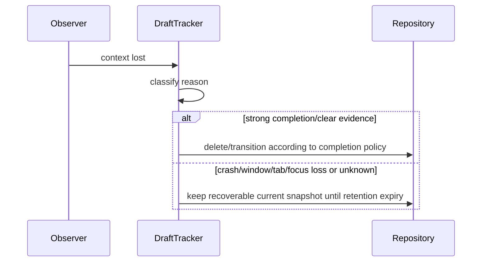
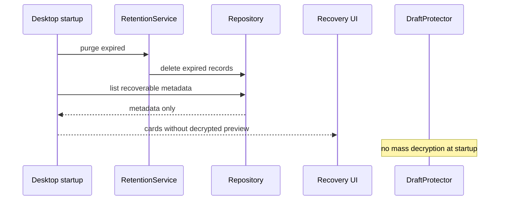
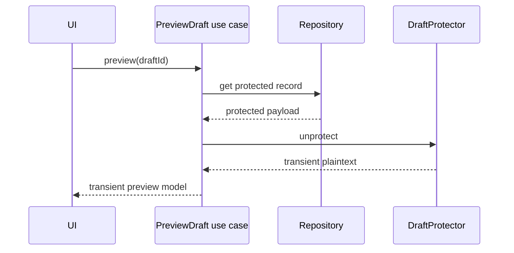
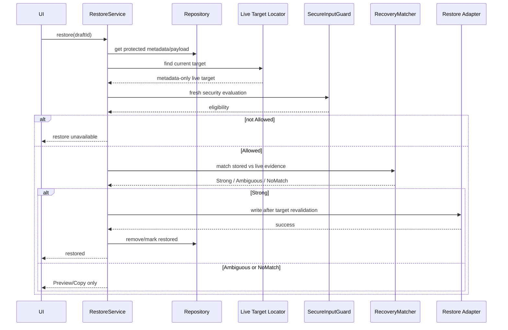
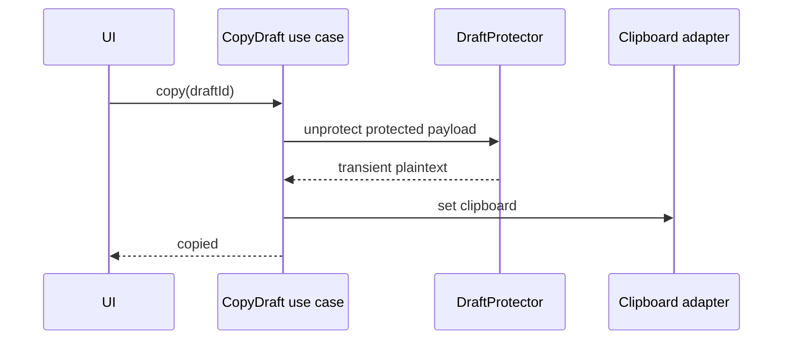
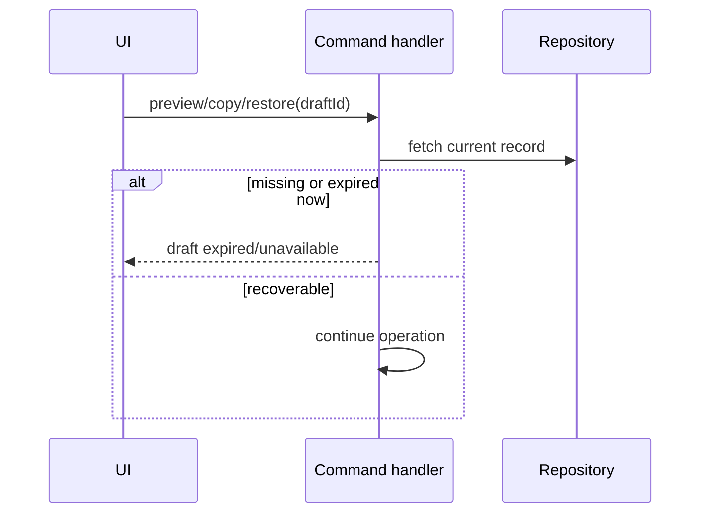

# Critical Sequence Diagrams

These diagrams are normative ordering constraints, not implementation-threading prescriptions.

## 1. Observe and checkpoint an allowed draft

**Forbidden ordering:** Read text -> classify security.

## 2. Denied/uncertain field

## 3. Context loss without completion

Focus loss alone is never strong completion evidence.

## 4. Startup and recovery list

## 5. Preview

UI must not cache plaintext preview indefinitely.

## 6. Direct Restore

## 7. Copy

Clipboard is an explicit user action and a known leakage boundary. Automatic clipboard clearing is not assumed.

## 8. Expiry race with UI action

The UI card's previously displayed expiry state is not authorization.
